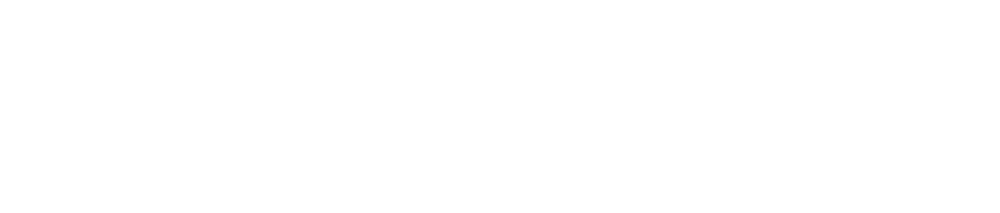
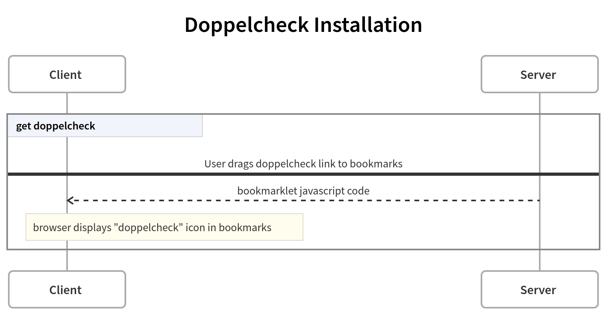
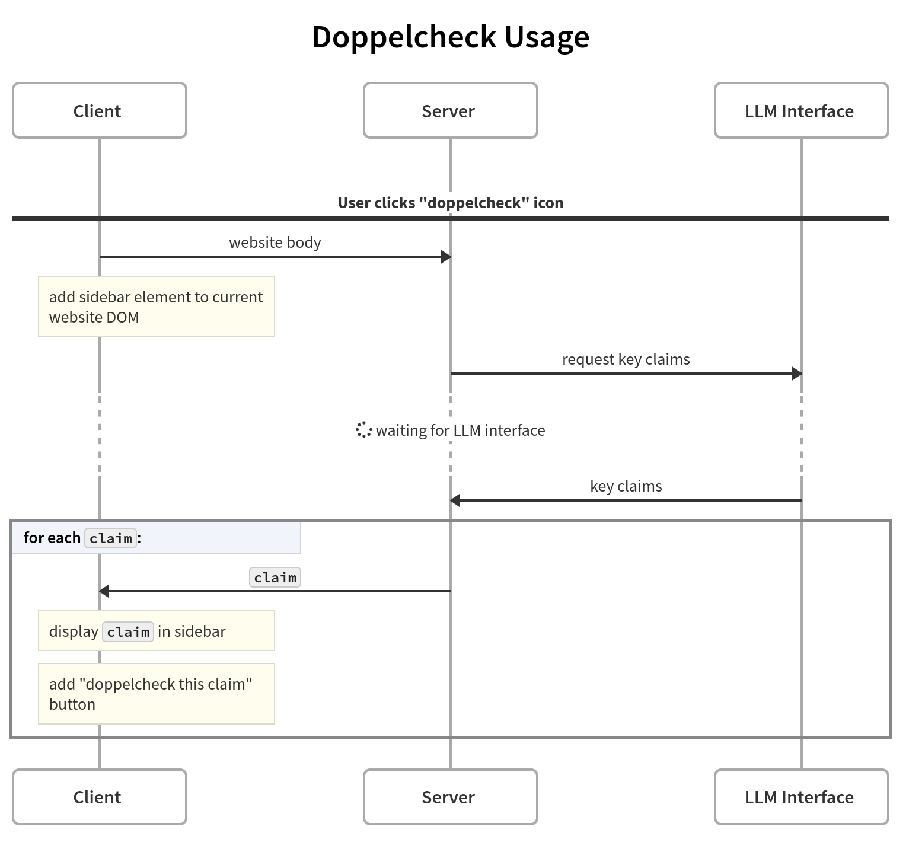
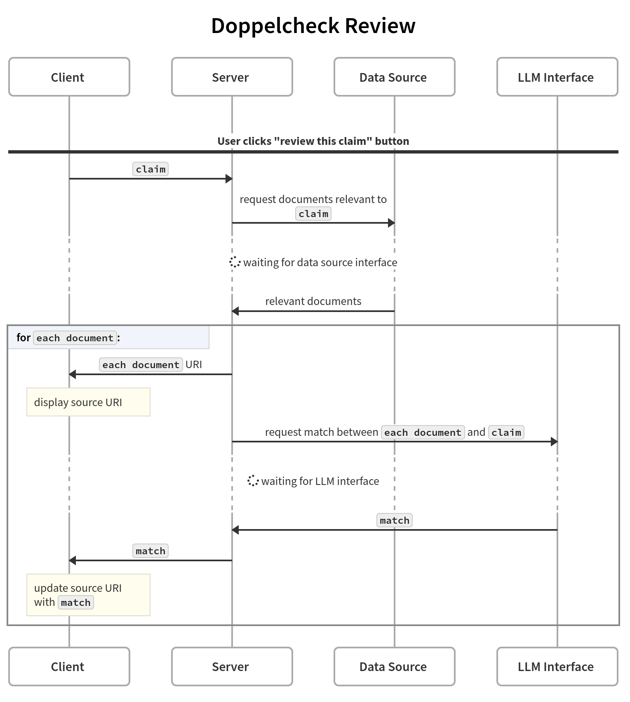

# Customized Press Reviews at the Touch of a Button

## Overview

Doppelcheck is a cutting-edge, browser-based AI assistance system, uniquely designed for journalists and media professionals. Leveraging advanced AI models, Doppelcheck automates the process of research, analysis, and detection of biases in news content. It simplifies the identification of strategic disinformation, enabling users to receive customized press reviews efficiently and effortlessly.

[installation.webm](https://github.com/Doppelcheck/main/assets/9195325/96b4468f-b12c-4e6c-baae-2b860c93c710)

[usage.webm](https://github.com/Doppelcheck/main/assets/9195325/bb4a3237-87f2-4536-9fa7-dc936dcce6d1)

## Features

- **AI-Powered Analysis**: Leverages Large Language Models (LLMs) to extract key claims from content, cross-reference them with a vast array of sources, and detect biases in news content, ensuring that you receive a balanced view of the narrative.
- **Automated Summaries**: Provides concise, bullet-pointed summaries of key claims from the content, enabling you to grasp the essence of the information quickly.
- **Configurable Research**: Offers out-of-the-box support for Google search, with plans to integrate other search engines and news searches. Users can tailor their research experience through a user-friendly UI and config files, ensuring that the information retrieved is relevant and comprehensive.
- **Intuitive UI**: Features a browser-based interface that makes configuration and result interpretation straightforward and user-friendly.

## Getting Started

To start using Doppelcheck:
- Users can always access [doppelcheck.com](https://doppelcheck.com) for immediate use.
- For enhanced data security or accessibility, users have the option to set up their own server. This involves:
  1. Installing Python 3.12 or higher
  2. Cloning the repository: 
     1. `git clone https://github.com/Doppelcheck/main`
  3. (Optional) Creating a virtual environment: 
     1. `cd main`
     2. `python3 -m venv venv`
     3. activating it with `source venv/bin/activate`
  4. Installing dependencies via pip:
     1. `pip install -r requirements.txt`
  5. Installing MS Playwright dependencies:
     1. `python3 -m playwright install`
     2. `sudo apt-get install libxcursor1 libxdamage1 libgtk-3-0 libpangocairo-1.0-0 libpango-1.0-0 libatk1.0-0 libcairo-gobject2 libcairo2 libgdk-pixbuf-2.0-0 libasound2 libdbus-glib-1-2`
  6. Copying the `config.example.py` file to `config.py` and configuring the following settings:
     1. `[storage_secret]`: random string used to encrypt client data
     2. `[custom_search_api_key]`: API key for the Google Custom Search API, get it [here](https://developers.google.com/custom-search/v1/introduction)
     3. `[custom_search_engine_id]`: ID of the Google Custom Search Engine, add a new search engine [here](https://programmablesearchengine.google.com/controlpanel/all)
     4. `[openAI_key]`: key for the OpenAI API, create one [here](https://platform.openai.com/api-keys)
  7. Running the server:
    - once: `python3 main.py`
    - as a systemd service:
      1. `sudo cp doppelcheck.example.service doppelcheck.service`
      2. set `User`, `WorkingDirectory`, `ExecStart`, and `Environment` in `doppelcheck.service` to your needs
      3. `sudo cp doppelcheck.service /etc/systemd/system/`
      4. `sudo systemctl enable doppelcheck`
      5. `sudo systemctl start doppelcheck`
  8. Open the Web UI at `localhost:8000` or whatever is set in `config.json['nicegui']['host']` and `config.json['nicegui']['port']`
     - use `https` if you provided `config.json['nicegui']['ssl_keyfile']` and `config.json['nicegui']['ssl_certfile']` (default)
     - use `http` otherwise

## Documentation

Detailed user guides and API documentation will be added during project development to facilitate easy navigation and utilization of Doppelcheck's features.

### Installation

### Usage

### Review

## Contributing

We welcome contributions from the community! If you're interested in improving Doppelcheck, you can contribute in the following ways:
- **Reporting Bugs**: Submit an issue in our repository, providing a detailed description of the problem and steps to reproduce it.
- **Feature Requests**: Have ideas on how to make Doppelcheck better? We'd love to hear from you! Please submit an issue, detailing your suggestions.
- **Pull Requests**: Contributions via pull requests are highly appreciated. Please ensure your code adheres to the coding standards of the project, and submit a pull request with a clear description of your changes.

## License

Doppelcheck is licensed under the MIT License. See the [LICENSE](LICENSE) file for more details.

## Contact

For any inquiries or further information, feel free to reach out at [wernsdorfer@gmail.com](mailto:wernsdorfer@gmail.com).

## Acknowledgements

Special thanks to our contributors and supporters, particularly Media Tech Lab, for their invaluable assistance in this project.

