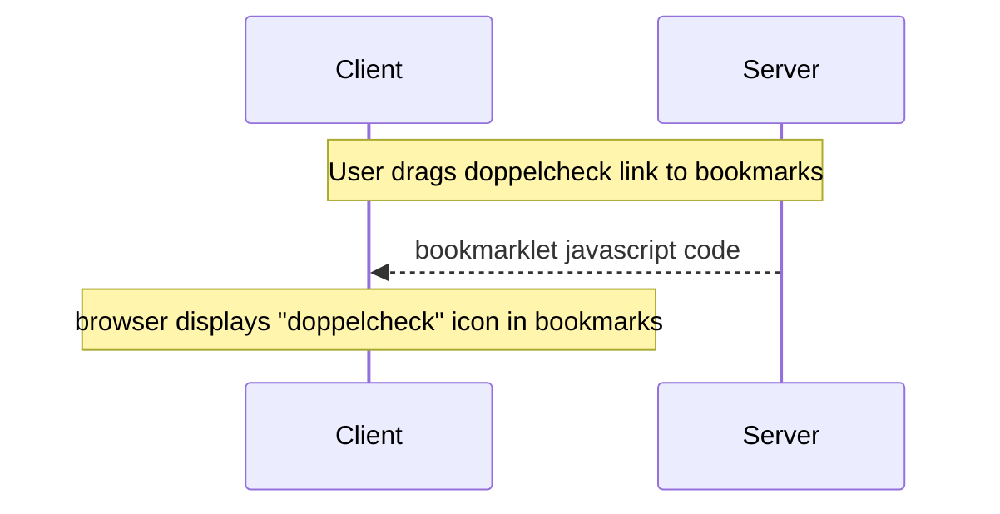
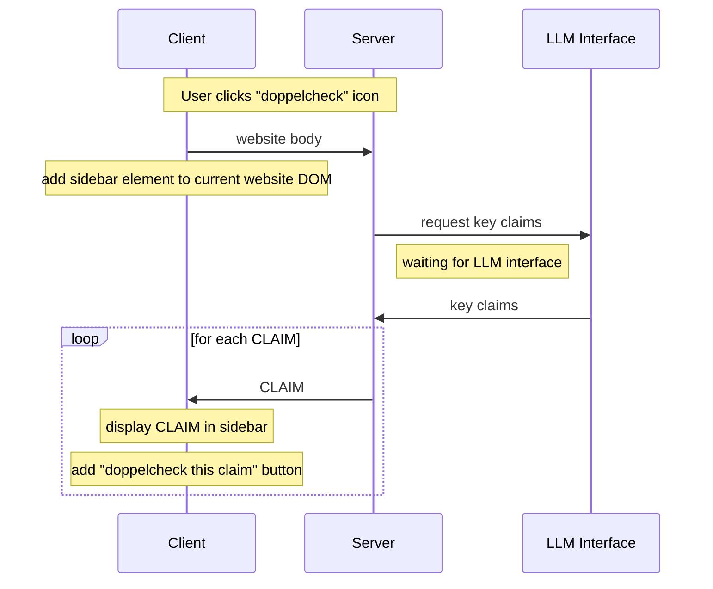

<style>
    :root {
        --outer-circle-size: 200px;
        --inner-circle-size: 80px;

        --outer-circle-width: 7px;
        --inner-circle-width: 4px;
        --vein-width: 3px;
    }

    .animation {
        position: relative;
        width: calc(var(--outer-circle-size) * 1.5);
        height: var(--outer-circle-size);
        overflow: hidden;
    }

    .doppelcheck-title {
        position: absolute;
        top: 80px;
        left: 320px;
        font-size: 50px;
        font-weight: bold;
        color: black;
    }

    .outer-circle, .inner-circle {
        border-radius: 50%;
        position: absolute;
    }


    .inner-circle {
        width: var(--inner-circle-size);
        height: var(--inner-circle-size);
        top: calc(var(--outer-circle-size) * .5);
        right: calc(var(--outer-circle-size) * .5);
        transform: translate(50%, -50%);
        box-shadow: inset 0 0 0 var(--inner-circle-width) black; /* Adjust the px value for border thickness */
    }

    .outer-circle {
        width: var(--outer-circle-size);
        height: var(--outer-circle-size);
        top: 0;
        right: 0;
        border-radius: 50%;
        position: absolute;
        box-shadow: inset 0 0 0 var(--outer-circle-width) black;
        animation: eraseLeftHalf 3s forwards; /* Animation to erase left half */
        animation-delay: 1s;
    }

    .veins {
        position: absolute;
        width: 100px;
        height: 100px;
        transform: translate(-65%, -50%);
        top: 50%;
        left: 50%;
    }

    .vein {
        position: absolute;
        height: 100px;
        width: 100%;
        animation: revealVeins 2s infinite;
        clip-path: inset(0 0 0 100%);
    }

    .vein1 {
        animation-delay: 4s;
    }

    .vein2 {
        animation-delay: 5.5s;
    }

    .vein3 {
        animation-delay: 6.5s;
    }

    .vein4 {
        animation-delay: 7s;
    }

    .veinRoot {
        position: absolute;
        width: 27px;
        height: var(--vein-width);
        background: black;
        transform: translate(67px, 9px) rotate(45deg);
    }
    .veinBranch {
        position: absolute;
        width: 72px;
        height: var(--vein-width);
        background: black;
        /*transform: translate(-40px, -17px);*/
    }
    .veinDot {
        position: absolute;
        width: 10px;
        height: 10px;
        background: black;
        transform: translate(-50%, calc(-50% + var(--vein-width) * .5));
        border-radius: 50%;
    }
    .veinBranchShort {
        width: 40px;
    }
    .veinRoot.veinRootShort {
        width: 25px;
        transform: translate(35px, 8px) rotate(45deg);

    }
    .veinMirrored {
        transform: scaleY(-1);
    }
    .veinOffset {
        transform: translate(20px, 30px);
    }
    .veinOffset.veinMirrored {
        transform: translate(20px, -30px) scaleY(-1);
    }

    @keyframes eraseLeftHalf {
        0% {
            clip-path: inset(0 0 0 0); /* Full circle is visible */
        }
        100% {
            clip-path: inset(0 0 0 50%); /* Half circle is visible */
        }
    }

    @keyframes revealVeins {
      0% {
        clip-path: inset(0 0 0 100%); /* Hidden initially */
      }
      70%, 90% {
        clip-path: inset(-10% -10% -10% -10%); /* Fully visible */
      }
    }
</style>

<div class="doppelcheck-title-container">
    <div class="animation">
        <!-- todo: https://chat.openai.com/c/8cc1ce34-a76b-4ae6-b319-7f8595624dce/ -->
        <div class="outer-circle"></div>
        <div class="inner-circle"></div>
        <div class="veins">
            <div class="vein vein1">
                <div class="veinRoot"></div>
                <div class="veinBranch"></div>
                <div class="veinDot"></div>
            </div>
            <div class="vein veinOffset vein2">
                <div class="veinRoot veinRootShort"></div>
                <div class="veinBranch veinBranchShort"></div>
                <div class="veinDot"></div>
            </div>
            <div class="vein veinOffset veinMirrored vein3">
                <div class="veinRoot veinRootShort"></div>
                <div class="veinBranch veinBranchShort"></div>
                <div class="veinDot"></div>
            </div>
            <div class="vein veinMirrored vein4">
                <div class="veinRoot"></div>
                <div class="veinBranch"></div>
                <div class="veinDot"></div>
            </div>
        </div>
    </div>
</div>

# Customized Press Reviews at the Touch of a Button

[Features](#features) | [Getting Started](#getting-started) | [Documentation](#documentation) | [Contributing](#contributing) | [License](#license) | [Contact](#contact) | [Acknowledgements](#acknowledgements)


## Overview

Doppelcheck is a cutting-edge, browser-based AI assistance system, uniquely designed for journalists and media
professionals. Leveraging advanced AI models, Doppelcheck automates the process of research, analysis, and detection of
biases in news content. It simplifies the identification of strategic disinformation, enabling users to receive
customized press reviews efficiently and effortlessly.

[Installation](https://github.com/Doppelcheck/main/assets/9195325/f604e167-cb44-4287-a5f9-fbcf6f63860f)

[Extraction](https://github.com/Doppelcheck/main/assets/9195325/e13e1313-b912-412e-bd42-5671496cda8a)

[Retrieval](https://github.com/Doppelcheck/main/assets/9195325/bb2cf100-b407-4b1d-9843-97be39c2133c)


## Features

- **AI-Powered Analysis**: Leverages Large Language Models (LLMs) to extract key claims from content, cross-reference
  them with a vast array of sources, and detect biases in news content, ensuring that you receive a balanced view of the
  narrative.
- **Automated Summaries**: Provides concise, bullet-pointed summaries of key claims from the content, enabling you to
  grasp the essence of the information quickly.
- **Configurable Research**: Offers out-of-the-box support for Google search, with plans to integrate other search
  engines and news searches. Users can tailor their research experience through a user-friendly UI and config files,
  ensuring that the information retrieved is relevant and comprehensive.
- **Intuitive UI**: Features a browser-based interface that makes configuration and result interpretation
  straightforward and user-friendly.

## Getting Started

Doppelcheck requires the following API keys:
- API key for the Google Custom Search API, get it [here](https://developers.google.com/custom-search/v1/introduction)
- ID of the Google Custom Search Engine, add a new search engine and get the ID [here](https://programmablesearchengine.google.com/controlpanel/all)
- key for the OpenAI API, create one [here](https://platform.openai.com/api-keys)


### Public Server
Users can always access [doppelcheck.com](https://doppelcheck.com) for immediate use.

> **Note:** Take care not to input sensitive data as data transfer and storage are not secure.

### Private Server
For enhanced data security or accessibility, users have the option to set up their own server.

#### Setting Up the Docker Image for Doppelcheck

You can set up the Doppelcheck application using Docker by following one of the two methods below.

Choose the option that best suits your setup preferences. Both methods will provide you with a running instance of the Doppelcheck application.

##### Option 1: Using a Git Clone

1. **Clone the Repository:** Begin by cloning the Doppelcheck repository to your local machine. Open a terminal or command prompt and run the following commands:

    ```bash
    git clone https://github.com/Doppelcheck/main.git
    cd main
    ```

2. **Start the Application:** With the repository cloned, navigate into the project directory and launch the application using `docker-compose`. This will build and start the necessary Docker containers:

    ```bash
    docker-compose up
    ```

    Wait for the process to complete. Once done, the application will be running and accessible.

##### Option 2: Pulling the Image from Docker Hub

If you prefer to skip the cloning process, you can directly pull the Docker image from Docker Hub and run it.

1. **Pull the Docker Image:** Fetch the latest Docker image for Doppelcheck from Docker Hub by executing the following command:

    ```bash
    docker pull wehnsdaefflae/doppelcheck_main
    ```

2. **Run the Container:** After pulling the image, start the container. This command will run the Docker image and map port 8000 on your host to port 8000 in the container, making the application accessible via the host machine:

    ```bash
    docker run -p 8000:8000 wehnsdaefflae/doppelcheck_main
    ```

**Access the Web UI:** Once the container is running, you can access the Doppelcheck web interface by opening your web browser and navigating to `http://localhost:8000`

> **Note:** Ensure you use `http` and not `https` in the URL, unless you have specifically configured SSL for local development.


#### Manual setup
1. Install Python 3.11.6 or higher (e.g. with `pyenv`)
2. Clone the repository:
    ```bash
    git clone https://github.com/Doppelcheck/main
    cd main
    ```
3. Install Playwright dependencies:
    ```bash
    sudo apt-get install libxcursor1 libxdamage1 libgtk-3-0 libpangocairo-1.0-0 libpango-1.0-0 libatk1.0-0 libcairo-gobject2 libcairo2 libgdk-pixbuf-2.0-0 libasound2 libdbus-glib-1-2
   ```
4. (Optional) Create a virtual environment:
    ```bash
    cd main
    python3 -m venv venv
    source venv/bin/activate
    ```
5. Install dependencies via pip:
    ```bash
    pip install --upgrade pip
    pip install -r requirements.txt
    ```
6. Install Playwright browsers:
    ```bash
    playwright install
   ```
7. Copy the `config.example.json` file to `config.json` and configure the following settings:
    - `[storage_secret]`: random string used to encrypt client data
8. Run the server:
    - once:
       ```bash
       python3 main.py
       ```
    - as a systemd service:
       ```bash
       sudo cp doppelcheck.example.service doppelcheck.service
       ```
      - set `User`, `WorkingDirectory`, `ExecStart`, and `Environment` in `doppelcheck.service` to your needs
      ```bash
      sudo cp doppelcheck.service /etc/systemd/system/
      sudo systemctl enable doppelcheck
      sudo systemctl start doppelcheck
      ```
9. (Optional) Set up certbot
10. Open the web UI at `localhost:8000` or whatever is set in `config.json['nicegui']['host']`
  and `config.json['nicegui']['port']`
   > **Note:** use `https` if you provided `config.json['nicegui']['ssl_keyfile']`
     and `config.json['nicegui']['ssl_certfile']` (default), use `http` otherwise

## Documentation

Detailed user guides and API documentation on configuration and architecture will be added during project development to facilitate easy navigation and utilization of Doppelcheck's features.

### Installation



### Usage



### Review


## Contributing

We welcome contributions from the community! If you're interested in improving Doppelcheck, you can contribute in the
following ways:

- **Reporting Bugs**: Submit an issue in our repository, providing a detailed description of the problem and steps to
  reproduce it.
- **Feature Requests**: Have ideas on how to make Doppelcheck better? We'd love to hear from you! Please submit an
  issue, detailing your suggestions.
- **Pull Requests**: Contributions via pull requests are highly appreciated. Please ensure your code adheres to the
  coding standards of the project, and submit a pull request with a clear description of your changes.

## License

Doppelcheck is licensed under the MIT License. See the [LICENSE](LICENSE) file for more details.

## Contact

For any inquiries or further information, feel free to reach out
at [wernsdorfer@gmail.com](mailto:wernsdorfer@gmail.com).

## Acknowledgements

Special thanks to our contributors and supporters, particularly Media Tech Lab, for their invaluable assistance in this
project.

<a href="https://www.media-lab.de/en/programs/media-tech-lab">
    
</a>
