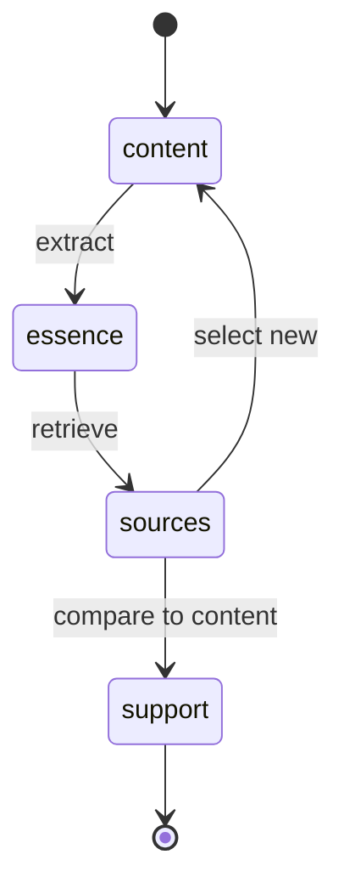
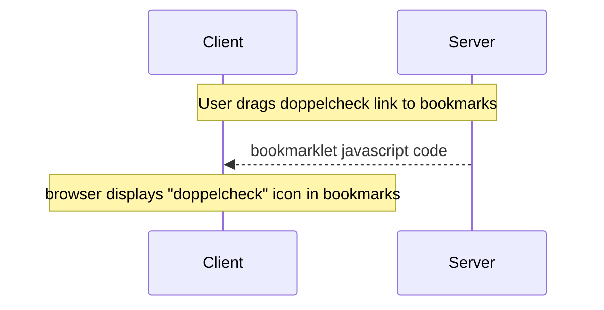
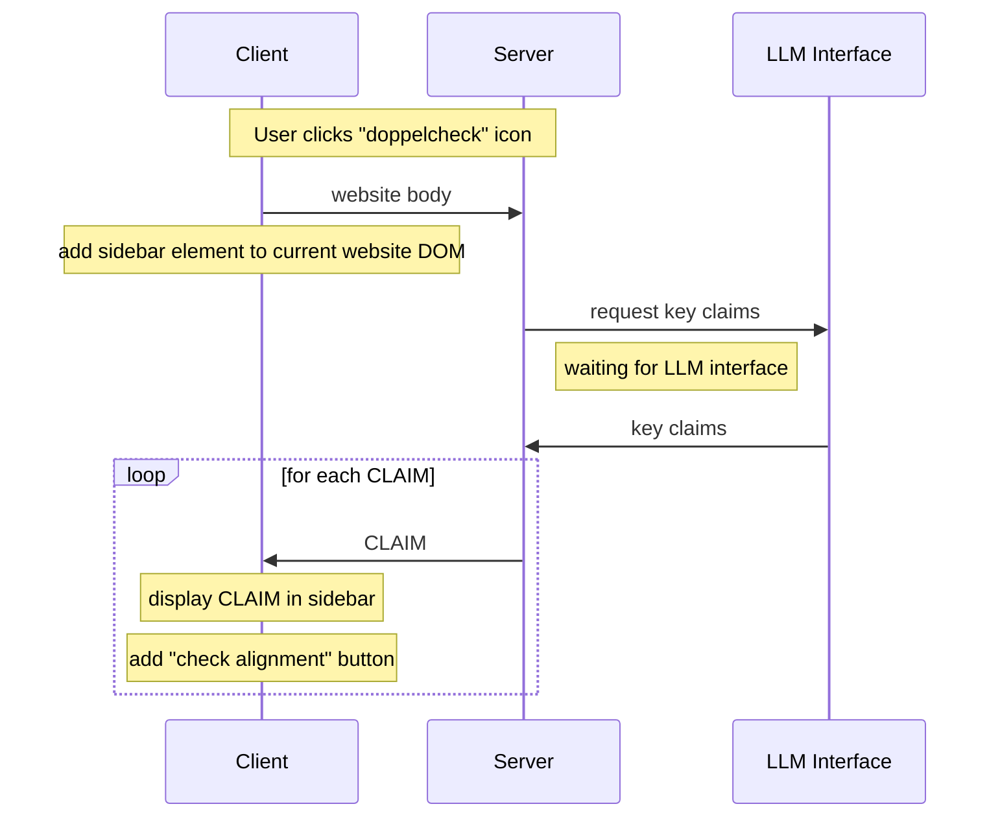
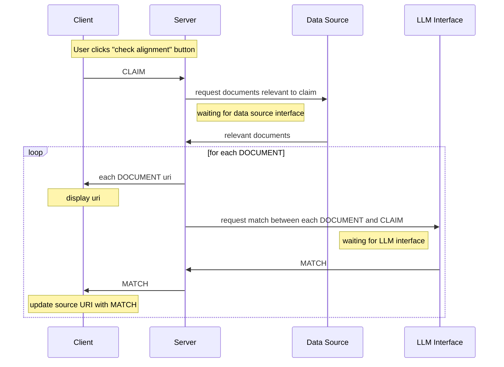

# DoppelCheck - Critical Information Analysis Tool

DoppelCheck is a sophisticated web content analysis tool designed to help users critically evaluate online information. It supports informed decision-making by providing automated fact-checking and information verification capabilities through a browser bookmarklet.

You can find extensive documentation [here](https://deepwiki.com/Doppelcheck/main).


## Overview

DoppelCheck adds a sidebar to web pages that allows users to:

1. **Extract key points** from web page content
2. **Find supporting evidence** for claims from external sources
3. **Compare and verify information** between original content and external sources
4. **Highlight relevant passages** in the original document
5. **Customize search sources** for verification

The tool is designed to strengthen digital literacy and support critical thinking about online information. It runs locally for enhanced privacy and security while being highly customizable.

DoppelCheck abstracts the process of information verification through these steps:



## What is a Bookmarklet?

If you're new to bookmarklets, they're simply special browser bookmarks that contain JavaScript code instead of a website address. When you click a bookmarklet, it runs this code on the current webpage you're viewing, adding new functionality without requiring a browser extension.

With the DoppelCheck bookmarklet:
- It's added to your browser's bookmarks bar just like any normal bookmark
- It works across most modern browsers (Chrome, Firefox, Safari, Edge)
- No installation in the traditional sense - just add it to your bookmarks
- It only activates when you click it, giving you complete control

## Features

- **Content Extraction**: Automatically identifies and summarizes key points from web content
- **Evidence Retrieval**: Searches for supporting evidence from external sources
- **Alignment Analysis**: Compares original content with external sources to verify accuracy
- **Visual Highlighting**: Highlights relevant text on the original page
- **Customizable Sources**: Add specific domains as trusted search sources
- **Local Processing**: Runs locally on your machine for privacy
- **Selection Summary**: Summarize any selected text with one click
- **Multilingual Support**: Works with German and English content

## Configuration

DoppelCheck can be customized by editing the `content_analysis_config.json` file:

```json
{
    "host": "0.0.0.0",
    "port": 5000,
    "model": "tulu3",
    "ollama_host": "http://localhost:11434",
    "debug": false,
    "custom_urls": [
        "https://sueddeutsche.de",
        "https://tagesschau.de"
    ],
    "google_custom_search_api_key": "YOUR_API_KEY_HERE",
    "google_custom_search_engine_id": "YOUR_SEARCH_ENGINE_ID_HERE"
}
```

Settings you can change:
- **host**: The server address (usually leave as is)
- **port**: The network port to use (change if port 5000 is already in use)
- **model**: The Ollama AI model to use (tulu3 is recommended)
- **ollama_host**: The address of your Ollama installation
- **debug**: Set to "true" if you're experiencing issues
- **custom_urls**: Pre-configured trusted domains for searches
- **google_custom_search_api_key**: Your Google API key (replace with your actual key)
- **google_custom_search_engine_id**: Your Google Search Engine ID (replace with your actual ID)

### API Keys

If you want to use your own Google search capabilities instead of the default ones, you'll need to obtain:

- **Google Custom Search API Key**: Get it from [Google Cloud Console](https://developers.google.com/custom-search/v1/introduction)
- **Google Custom Search Engine ID**: Create a new search engine and get the ID from [Programmable Search Engine Control Panel](https://programmablesearchengine.google.com/controlpanel/all)

Then update these values in your `content_analysis_config.json` file. The example values shown in the configuration above are placeholders and will not work - you must replace them with your own credentials.

**Note**: When running with Docker, the Ollama service runs on port 11435 (mapped from container port 11434), but DoppelCheck is configured to connect to it internally on port 11434. If you're running Ollama separately outside of Docker, use port 11434 in your configuration.

## Installation

DoppelCheck requires two main components to work properly:
1. The local DoppelCheck server
2. The DoppelCheck bookmarklet in your browser

Follow these steps in order to set up DoppelCheck:

### 1. Set Up Prerequisites

Before you begin, make sure you have the following installed:

- [Docker](https://docs.docker.com/get-docker/) and [Docker Compose](https://docs.docker.com/compose/install/)
- For GPU acceleration (optional):
  - NVIDIA GPU: [NVIDIA Container Toolkit](https://docs.nvidia.com/datacenter/cloud-native/container-toolkit/latest/install-guide.html)
  - AMD GPU: ROCm drivers installed on host

### 2. Get the DoppelCheck Code

1. Clone the repository:
   ```bash
   git clone https://github.com/Doppelcheck/main
   cd main
   ```

### 3. Start the Local Server

Run DoppelCheck with one of the following commands:

```bash
# CPU-only mode (default)
docker compose up

# With NVIDIA GPU acceleration
sudo docker compose --profile nvidia up

# With AMD ROCm acceleration
sudo docker compose --profile amd up
```

Wait for the startup process to complete. You should see log messages indicating that both the DoppelCheck server and the Ollama LLM service are running. The DoppelCheck server will be available at `http://localhost:5000`.

### 4. Install the Bookmarklet in Your Browser

Once the server is running:

1. Open your browser and navigate to `http://localhost:5000`
2. Make sure your bookmarks bar is visible (press Ctrl+Shift+B in Chrome/Firefox on Windows/Linux or Command+Shift+B on Mac)
3. Find the "doppelcheck⠆" button on the DoppelCheck homepage
4. Drag this button to your bookmarks bar
5. The bookmarklet is now installed and ready to use on any webpage



### 5. Use DoppelCheck

Now you can use DoppelCheck on any webpage:
1. Navigate to a webpage you want to analyze
2. Click the "doppelcheck⠆" bookmark in your bookmarks bar
3. DoppelCheck will analyze the page and display results in a sidebar

> **Important:** Remember that both the Docker containers must be running whenever you want to use DoppelCheck. If you restart your computer or stop the Docker containers, you'll need to start the DoppelCheck server again (step 3) before using the bookmarklet.

### Additional Configuration Options

#### Setting up NVIDIA Container Toolkit

If you're planning to use GPU acceleration with an NVIDIA GPU, you need to properly install and configure the NVIDIA Container Toolkit:

1. Install the NVIDIA Container Toolkit:
   ```bash
   # Add the NVIDIA Container Toolkit repository
   curl -s -L https://nvidia.github.io/nvidia-container-runtime/gpgkey | sudo apt-key add -
   distribution=$(. /etc/os-release;echo $ID$VERSION_ID)
   curl -s -L https://nvidia.github.io/nvidia-container-runtime/$distribution/nvidia-container-runtime.list | sudo tee /etc/apt/sources.list.d/nvidia-container-runtime.list
   sudo apt-get update
   
   # Install nvidia-container-toolkit package
   sudo apt-get install -y nvidia-container-toolkit
   ```

2. Configure Docker to use the NVIDIA runtime:
   ```bash
   sudo nvidia-ctk runtime configure --runtime=docker
   ```

3. Restart Docker to apply the changes:
   ```bash
   sudo systemctl restart docker
   ```

4. Verify your NVIDIA driver installation:
   ```bash
   nvidia-smi
   ```
   This command should display information about your GPU and NVIDIA driver version. If it fails, you may need to install or update your NVIDIA drivers first.

5. Verify the NVIDIA Container Toolkit setup:
   ```bash
   sudo docker run --rm --gpus all pytorch/pytorch:2.2.2-cuda12.1-cudnn8-runtime nvidia-smi
   ```     
   Using the same image as in your Dockerfile (`pytorch/pytorch:2.2.2-cuda12.1-cudnn8-runtime`) ensures that you're testing with the same CUDA version (12.1) that your application will use. This is more relevant than using a generic CUDA image that might have a different version.

### Package Dependency Conflicts

When running DoppelCheck with Docker, you might encounter package dependency conflicts, especially between PyTorch, torchvision, and transformers packages. This typically happens because the CUDA-compiled version of certain operators isn't compatible with your current setup.

If you encounter errors like `RuntimeError: operator torchvision::nms does not exist` or NumPy compatibility issues, you can try:

1. **Fix in Docker environment**: 
   ```bash
   # Access the running container
   docker exec -it doppelcheck-nvidia bash
   
   # Inside the container, install compatible versions
   pip install torch==2.1.2 torchvision==0.16.2 transformers==4.41.0 --extra-index-url https://download.pytorch.org/whl/cu121
   pip install numpy<2.0.0
   ```

2. **Update requirements.txt**: If rebuilding the image, modify the requirements.txt file to use compatible versions:
   ```
   torch==2.1.2
   torchvision==0.16.2
   transformers==4.41.0
   --extra-index-url https://download.pytorch.org/whl/cu121
   numpy<2.0.0
   ```

3. **Force CPU mode**: In some cases, forcing CPU mode can bypass GPU compatibility issues:
   ```bash
   # Run in CPU-only mode
   docker compose up
   ```

## Usage

When you use DoppelCheck, it follows this workflow:



### Verification Process

When you request to check the alignment of content with external sources:



## Troubleshooting

### Common Issues and Solutions

#### The server won't start
- Check if Python is correctly installed: Run `python --version` or `python3 --version`
- Ensure Ollama is running: Open a new terminal and run `ollama list`
- Check if port 5000 is already in use: Try changing the port in the config file

#### The bookmarklet doesn't work
- Make sure the DoppelCheck server is running
- Check if your browser is blocking JavaScript
- Try using a different browser
- Refresh the page and try again

#### No content appears in the sidebar
- The page might not contain suitable text content for analysis
- Try a different webpage with more text content
- Check if the website blocks content extraction

#### Searches don't return results
- Check your internet connection
- Try different search terms
- Add more specific trusted domains

#### Error: "Ollama not found"
- Make sure you've installed Ollama from [ollama.ai](https://ollama.ai/download)
- Restart your computer
- Check if Ollama is running in the background

### Getting Support
If you continue to experience issues:
- Check the [GitHub repository](https://github.com/Doppelcheck) for known issues
- Submit a bug report with detailed information about your problem
- Contact support at info@doppelcheck.com

## Frequently Asked Questions

**Q: Is my data private when using DoppelCheck?**  
A: Yes! DoppelCheck processes everything locally on your computer. The content of pages you analyze never leaves your machine except when searching for supporting evidence.

**Q: Do I need an internet connection?**  
A: Yes, for two reasons: to browse webpages and to search for supporting evidence. The core analysis happens locally.

**Q: Can I use DoppelCheck in languages other than English?**  
A: Yes, DoppelCheck works well with both English and German content.

**Q: How accurate is the analysis?**  
A: DoppelCheck uses AI to identify key points and compare sources. The accuracy depends on the quality and availability of related content online. Always use your judgment when evaluating results.

**Q: Will DoppelCheck slow down my browsing?**  
A: The bookmarklet only activates when you click it, so it won't affect normal browsing. When analyzing a page, it uses some computer resources, but modern computers can handle this without issue.

**Q: Is DoppelCheck free to use?**  
A: Yes, DoppelCheck is a free, open-source project supported by WPK-Innovationsfonds and Media Lab Bayern.


## Project Structure

For those interested in the technical details:

- `server/`: Main server code
  - `app.py`: FastAPI application
  - `bookmarklet.js`: Client-side JavaScript code
  - `routes.py`: API routes
  - `models.py`: Data models
  - `chunkers/`: Text chunking algorithms
  - `retrievers/`: Search and retrieval modules
  - `services/`: Core services for extraction, comparison, etc.
  - `templates/`: HTML templates
  - `static/`: Static assets (CSS, JS, images)
  - `utils/`: Utility functions

## Development

For development, set up a virtual environment:

```bash
python -m venv venv
source venv/bin/activate  # On Windows: venv\Scripts\activate
pip install -r requirements.txt
```

Start the server in debug mode:

```bash
python main.py --debug
```

## Contributing

DoppelCheck is an ongoing project. Contributions are welcome through:

- **Bug reports and feature requests**: If you find issues or have ideas for improvements, please open an issue in our GitHub repository.
- **Code contributions**: Pull requests are highly appreciated. Please ensure your code adheres to the project's coding standards and include proper documentation.
- **Documentation improvements**: Help us make DoppelCheck more accessible by improving our documentation.
- **Testing and feedback**: Try DoppelCheck in different environments and let us know how it works.
- **Plugin Development**: Extend DoppelCheck's functionality by developing plugins for additional data sources or enhanced capabilities.

When submitting pull requests, please:
1. Focus on a single feature or bug fix per PR
2. Include appropriate tests
3. Update documentation if needed
4. Follow existing code styles

## License

This project uses components with various licenses:
- Code: MIT License
- IBM Plex fonts: SIL Open Font License 1.1

## Project Background

DoppelCheck is a project by AI scientist and consultant Mark Wernsdorfer, supported by funding programs from WPK-Innovationsfonds and Media Lab Bayern. It aims to promote critical evaluation of online information and strengthen digital literacy through technology.

## Acknowledgements

Special thanks to our contributors and supporters for their invaluable assistance in this project:

<a href="https://www.media-lab.de/en/programs/media-tech-lab" target="_blank">
    
</a>

<a href="https://innovationsfonds.wpk.org/" target="_blank">
    
</a>

## Contact

- Website: [Mark Wernsdorfer](https://markwernsdorfer.com/)
- Project Links:
  - [WPK Innovationsfonds](https://innovationsfonds.wpk.org/doppelcheck-ki-gestuetzte-lokale-faktenpruefung/)
  - [Media Lab Bayern](https://media-lab.de/de/angebote/media-tech-lab/doppelcheck/)
  - [GitHub](https://github.com/Doppelcheck)
